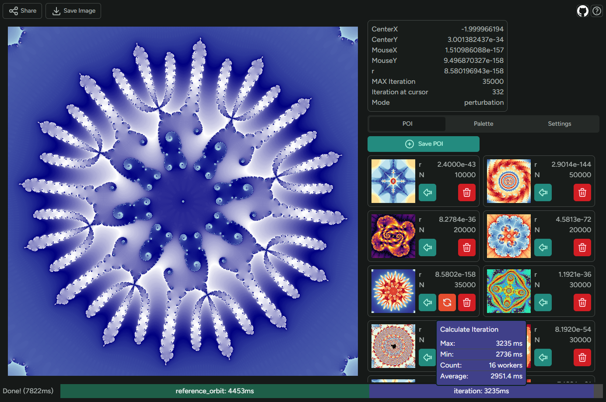
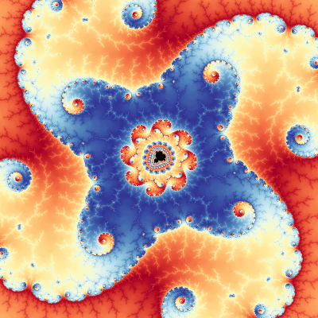
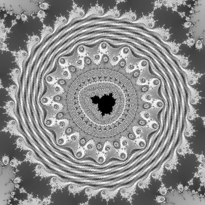
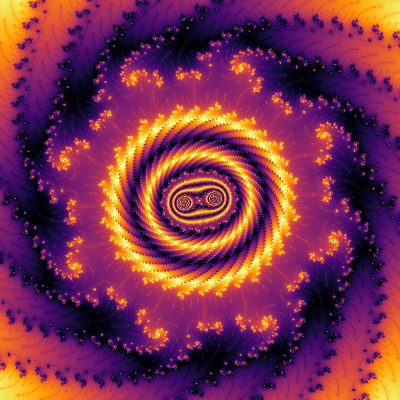
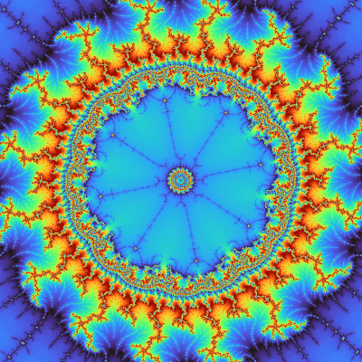
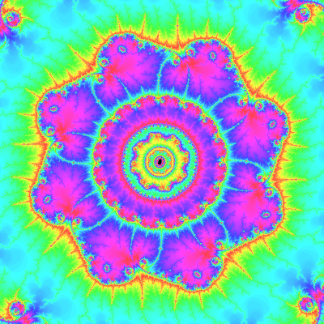
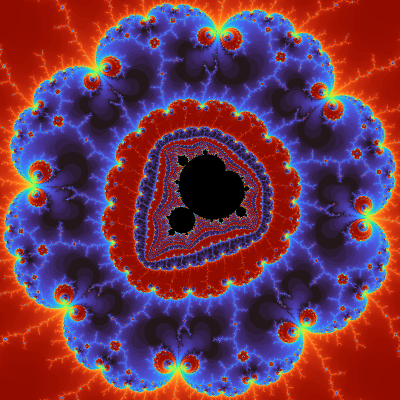

<h1 align="center">
  p5mandelbrot
</h1>

<h2 align="center">
Web-based Interactive Mandelbrot Set Viewer by p5.js
</h2>

  <a href="/README.md">English</a>・
  <a href="/README-ja.md">日本語</a>

## 試す

👉 https://p5mandelbrot.pages.dev

## これは何？

ブラウザで動く、比較的高速で深いところまで見れるマンデルブロ集合ビューアです

## 機能

- Web Workerによる並列描画
- [摂動法による計算](https://en.wikipedia.org/wiki/Plotting_algorithms_for_the_Mandelbrot_set#Perturbation_theory_and_series_approximation)で`r: 1e-300`の深さまで描画可能
  - double(f64)では`r: 1e-14`が限界
- 気になった場所を保存できるリスト (localStorageに保存)
- 現在地点の共有URLの出力
- png画像出力
- パレットの簡易な編集機能 (長さとオフセットのみ)
- パレットのオフセットアニメーション

## 画像

### 画像をクリックするとアプリ内で同じ位置を開きます

<a href="https://p5mandelbrot.pages.dev/?x=-1.628862884979677636095426449959859010842630371832025956260625433903197532513022790394177640723727041808972443346150109097014368877151730362996551339014455132166441761137760639778197842397723624417672891906866059458750971904&y=0.001502065389380933389120025595611444917053151899160138645056523772189121430288877889320457274596161102973726449569385093906231155533425802369952240475756150306868105118194095501857879511907077405637510153197543170567569408&r=2.9014219670751072339297340078956627449111563682086819976447985485406258855936e-144&N=50000&mode=perturbation" target="_blank" rel="noopener noreferrer"></a>

<a href="https://p5mandelbrot.pages.dev/?x=-0.154651046065681195954069941801887201628711016770178879409663862799280825481728359145282185228162588570422562476538480274292563032960742199245042782604021968599916142953125&y=1.03100188829820970323326467188711829495132557266331701985253329251213479775239159430498134546903588137283684308536662011649305216369937916843074130608298500223630127600068918472926015625&r=5.3204107681274320423270480957110502838802026324219011370879898137240923369698515678052837041596125229354571714470966238022953777435430290328156862194211775396373427173601757743581527073984375e-9&N=10000&mode=normal" target="_blank" rel="noopener noreferrer"></a>
<a href="https://p5mandelbrot.pages.dev/?x=0.43867716701945882602883664862501598909023888524432039618467429667318497624865659405032524270010214699394553651131508387532212999456591199208978687957125014042398155699119444136018932331221337685378802970556178547128893299379628775830714099109172821044921875&y=0.3573437772356753619126484864541585787148755277893692806219767292158831659783866755646463856621056415233043515572311943751280676245714383999614164483550085107467604247216921322126659502138891290826712655491362559388727657519245679668454547226428985595703125&r=3.3554432e-41&N=40000&mode=perturbation" target="_blank" rel="noopener noreferrer"></a>
