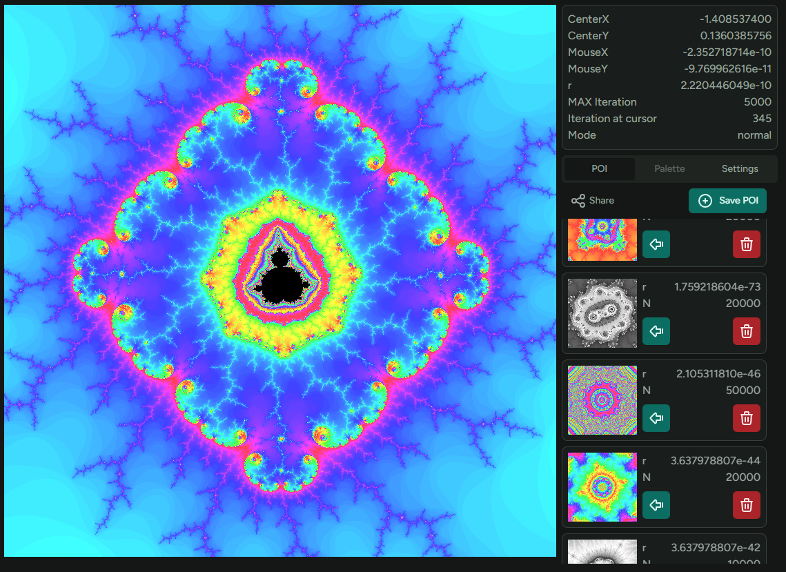

# 👉 https://k-chop.github.io/p5mandelbrot/

[](https://k-chop.github.io/p5mandelbrot/?x=-1.4086715391273899710353344128325189461158549457353906833834533845374841539084637890277853176266053132854725096103278880087619466174234400420041147462259641482834981992086916823187762977608609398482192187386808063193819859908567821689597243055614458721869208801535933162085711956024169921875&y=0.13573356233756149256744687457950769127011686997728844820996102569735378352590590220152458410050547531090509123034055044379097857400988251112666966802506466488123544875508168890228011660364830955412444899667064886388828880580919290541421808049538100249264971353113651275634765625&r=1.6086117467087590369184225542099028026901186191358196334957524147198706498672118518448448746413529341221875127304624139511948635702639718900719664575640251440342975985942075567436404526233673095703125e-80&N=30000&mode=perturbation)
